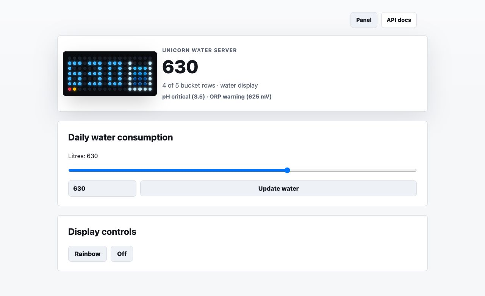

# Unicorn Water Server

Display daily domestic water consumption on a Raspberry Pi with a Pimoroni
Unicorn HAT Mini.



The project provides:

- A 17x7 water-consumption display designed for Unicorn HAT Mini.
- A validated HTTP API for external water-monitoring scripts.
- A responsive React control panel with a simulated matrix preview.
- Built-in API documentation.
- A systemd service and Raspberry Pi installation scripts.
- A hardware-free dummy mode for local development and automated tests.
- A startup rainbow that confirms the Unicorn HAT Mini is working before the
  first water update arrives.

## Project Lineage

Unicorn Water Server is derived from `unicorn-solar-server`, which is derived
from `unicorn-busy-server`.

The derived project reuses the Flask/Vite structure and Unicorn hardware
wrapper, but replaces the solar battery display with a water-consumption
display and a focused API.

## Display

The server requires the Unicorn HAT Mini's native 17x7 orientation. It sets
rotation `0` and refuses to start with a different display shape so the display
cannot be silently cropped or rotated.

- The left eleven columns show up to three consumed-litre digits.
- Litres are implicit, so no unit label is rendered on the matrix.
- One empty column separates the number from the bucket.
- The right five columns show a bucket with a pale blue left side, right side,
  and base.
- The bucket top edge is open.
- Water fills the five inner rows from bottom to top.
- Each 200 litres lights one additional row: `1-200`, `201-400`,
  `401-600`, `601-800`, and `801+`.
- Values above `999` are accepted, but the matrix displays `999` with red
  digits as an overflow indicator.
- Darker blue sits at the bottom, brighter blue at the surface.
- Small bright pixels at the surface shift between frames to create a subtle
  ripple.

| Daily litres | Active rows |
|---:|---:|
| `0` | 0 |
| `1-200` | 1 |
| `201-400` | 2 |
| `401-600` | 3 |
| `601-800` | 4 |
| `801+` | 5 |

## API

### Update Water Consumption

```http
POST /api/water
Content-Type: application/json

{"liters": 30}
```

`liters` accepts any non-negative finite number. Values are rendered as
integers. Values above `999` keep the real `liters` value in the API response,
but `displayLiters` is capped at `999` and `overflow` is set to `true`; the
matrix shows red `999` digits.

### Read Status

```http
GET /api/status
```

The response includes the current litres, displayed litres, overflow state,
active bucket rows, hardware type, display dimensions, rotation, display mode,
and last update information.

### Discover Endpoints

```http
GET /api/
```

### Validate The Display

The server starts with this rainbow animation instead of showing an empty
display, making hardware and service startup failures easier to identify.

```http
POST /api/rainbow
Content-Type: application/json

{"brightness": 1, "speed": 0.1}
```

Both values are optional.

### Turn Off The Display

```http
GET /api/off
```

`POST /api/off` is also accepted. Any water update stops the rainbow or off
state and restores the water display.

## Installation

The service name is `unicorn-water.service` and the default HTTP port is
`9002`, leaving `9000` for Unicorn Busy Server and `9001` for Unicorn Solar
Server.

The installer follows the venv-based service model already proven on
`zeropi.local` for Unicorn Busy Server:

- The service runs as the target user, `pi` by default, not as root.
- Python dependencies are installed into a user-owned virtual environment,
  `/home/pi/.env` by default.
- The systemd unit runs `server.py` through that virtual environment's Python
  interpreter.
- `PYTHONUNBUFFERED=1` is set in the unit for predictable service logs.

When installing from a local checkout, the intended shape is:

```bash
sudo bash ./install.sh -V -i /home/pi/unicorn-water-server --user pi --venv-dir /home/pi/.env
```

After the project has been cloned on the Raspberry Pi, the same installer can
be run from the checkout:

```bash
cd /home/pi/unicorn-water-server
sudo bash ./install.sh -V -i /home/pi/unicorn-water-server --user pi --venv-dir /home/pi/.env
```

```bash
systemctl status unicorn-water.service
```

Open the control panel at:

```text
http://<raspberry-pi-ip>:9002/
```

## Coexisting With Other Unicorn Servers

Only one service should control the Unicorn HAT Mini at a time. Water Server's
systemd unit conflicts with `busylight.service`, and its installer also stops
`unicorn-solar.service` if present.

| Project | systemd service | HTTP port |
|---|---|---:|
| Unicorn Busy Server | `busylight.service` | `9000` |
| Unicorn Solar Server | `unicorn-solar.service` | `9001` |
| Unicorn Water Server | `unicorn-water.service` | `9002` |

## Development

Create a Python environment and run the server:

```bash
python3 -m venv .venv
.venv/bin/python -m pip install flask flask-cors jsmin
.venv/bin/python server.py
```

Without compatible hardware, the wrapper automatically uses a 17x7 dummy
display. The server and control panel are available at
`http://localhost:9002/`.

Run the checks used by CI:

```bash
python -m unittest -v
cd frontend
npm ci
npm run build
```

The public API is intentionally limited to `/api/`, `/api/status`,
`/api/water`, `/api/rainbow`, and `/api/off`; solar battery, tariff, and busy
presence endpoints are not carried over.

This project was developed with assistance from OpenAI Codex.
